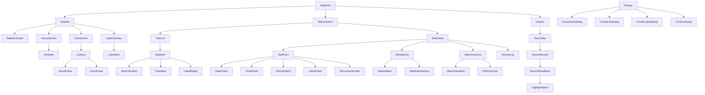

# Daily Task Planner - Component Specification

## Overview

This document defines all UI components, their props interfaces, and relationships for the daily task planner application.

---

## Layout Components

### AppShell

Main application shell providing the split-view layout.

```typescript
interface AppShellProps {
  children: React.ReactNode;
  sidebar: React.ReactNode;
  mainContent: React.ReactNode;
}

// Features:
// - Responsive sidebar (collapsible on mobile)
// - CSS Grid layout: sidebar + main
// - Dark/light theme support
// - Drag-to-resize sidebar width (persisted)
```

### Sidebar

Collapsible navigation sidebar containing views, lists, and labels.

```typescript
interface SidebarProps {
  isCollapsed?: boolean;
  onToggle?: () => void;
  width?: number;  // Default: 280px
}

interface SidebarSectionProps {
  title: string;
  icon?: string;
  isExpanded: boolean;
  onToggle: () => void;
  children: React.ReactNode;
}
```

### MainContent

Primary content area showing task list and detail view.

```typescript
interface MainContentProps {
  header: React.ReactNode;
  taskList: React.ReactNode;
  taskDetail?: React.ReactNode;  // Optional split view
  viewMode?: 'list' | 'split';   // Default: 'list'
}
```

### Header

Top navigation bar with search, view title, and actions.

```typescript
interface HeaderProps {
  title: string;
  viewIcon?: string;
  taskCount?: number;
  onSearch?: (query: string) => void;
  onToggleCompleted?: () => void;
  showCompleted?: boolean;
  actions?: React.ReactNode;
}
```

---

## Task Components

### TaskList

Virtualized list of tasks with filtering and sorting.

```typescript
interface TaskListProps {
  tasks: Task[];
  isLoading?: boolean;
  emptyState?: React.ReactNode;
  onTaskClick?: (taskId: number) => void;
  onTaskComplete?: (taskId: number, completed: boolean) => void;
  selectedTaskId?: number | null;
  sortBy?: 'date' | 'priority' | 'created' | 'manual';
  groupBy?: 'date' | 'list' | 'priority' | 'none';
}

interface TaskGroupProps {
  title: string;
  count: number;
  tasks: Task[];
  isCollapsed?: boolean;
  onToggle?: () => void;
}
```

### TaskItem

Individual task row displayed in lists.

```typescript
interface TaskItemProps {
  task: Task;
  isSelected?: boolean;
  isCompact?: boolean;  // Minimal display for subtasks
  onClick?: () => void;
  onComplete?: (completed: boolean) => void;
  onContextMenu?: (e: React.MouseEvent) => void;
  dragHandleProps?: DragHandleProps;  // For reordering
}

interface TaskMetaProps {
  dueDate?: string;
  priority?: Priority;
  estimate?: string;
  subtaskCount?: { completed: number; total: number };
  attachmentCount?: number;
  labelIds?: number[];
  maxVisibleLabels?: number;
}
```

### TaskCheckbox

Animated completion toggle with Framer Motion.

```typescript
interface TaskCheckboxProps {
  checked: boolean;
  onChange: (checked: boolean) => void;
  size?: 'sm' | 'md' | 'lg';
  isLoading?: boolean;
}
```

### TaskDetail

Full task editing panel in split view.

```typescript
interface TaskDetailProps {
  task: Task | null;
  isEditing?: boolean;
  onSave?: (task: UpdateTaskRequest) => void;
  onDelete?: (taskId: number) => void;
  onClose?: () => void;
  lists: List[];
  labels: Label[];
}
```

### TaskForm

Create/edit task form with all fields.

```typescript
interface TaskFormProps {
  task?: Partial<Task>;
  lists: List[];
  labels: Label[];
  defaultListId?: number;
  onSubmit: (data: CreateTaskRequest | UpdateTaskRequest) => void;
  onCancel?: () => void;
  isSubmitting?: boolean;
}

// Form field components:
interface TaskNameInputProps {
  value: string;
  onChange: (value: string) => void;
  placeholder?: string;
  autoFocus?: boolean;
}

interface TaskDescriptionInputProps {
  value: string;
  onChange: (value: string) => void;
  placeholder?: string;
  maxLength?: number;
}
```

---

## Sidebar Components

### ViewsSection

Navigation links for built-in views (Today, Next 7 Days, etc.).

```typescript
interface ViewsSectionProps {
  currentView: ViewType;
  onViewChange: (view: ViewType) => void;
  counts?: Record<ViewType, number>;
}

interface ViewItemProps {
  view: ViewType;
  title: string;
  icon: string;
  count?: number;
  isActive: boolean;
  onClick: () => void;
}
```

### ListsSection

User-created lists with Inbox at top.

```typescript
interface ListsSectionProps {
  lists: List[];
  selectedListId?: number;
  onListSelect: (listId: number) => void;
  onListCreate: (data: CreateListRequest) => void;
  onListEdit: (listId: number, data: Partial<List>) => void;
  onListDelete: (listId: number) => void;
  onListReorder: (listIds: number[]) => void;
}

interface ListItemProps {
  list: List;
  isSelected: boolean;
  taskCount?: number;
  onClick: () => void;
  onEdit?: () => void;
  onDelete?: () => void;
  dragHandleProps?: DragHandleProps;
}
```

### LabelsSection

Label filter section in sidebar.

```typescript
interface LabelsSectionProps {
  labels: Label[];
  selectedLabelIds?: number[];
  onLabelToggle: (labelId: number) => void;
  onLabelCreate: (data: CreateLabelRequest) => void;
  onLabelEdit: (labelId: number, data: Partial<Label>) => void;
  onLabelDelete: (labelId: number) => void;
}

interface LabelItemProps {
  label: Label;
  isSelected: boolean;
  onClick: () => void;
  onEdit?: () => void;
  onDelete?: () => void;
}
```

### SidebarItem

Reusable navigation item for sidebar.

```typescript
interface SidebarItemProps {
  icon?: string | React.ReactNode;
  emoji?: string;
  title: string;
  count?: number;
  isActive?: boolean;
  isCollapsed?: boolean;
  onClick: () => void;
  contextMenu?: ContextMenuItem[];
  dragHandleProps?: DragHandleProps;
}
```

---

## Form Components

### DatePicker

Date selection with quick shortcuts.

```typescript
interface DatePickerProps {
  value?: string;  // YYYY-MM-DD
  onChange: (date: string | undefined) => void;
  placeholder?: string;
  minDate?: string;
  maxDate?: string;
  shortcuts?: DateShortcut[];
}

interface DateShortcut {
  label: string;
  value: string;  // YYYY-MM-DD
}

// Default shortcuts: Today, Tomorrow, Next Week
```

### TimePicker

HH:mm time input with validation.

```typescript
interface TimePickerProps {
  value?: string;  // HH:mm
  onChange: (time: string | undefined) => void;
  placeholder?: string;
  min?: string;
  max?: string;
  step?: number;  // Minutes, default: 15
}
```

### PrioritySelect

Priority dropdown with color indicators.

```typescript
interface PrioritySelectProps {
  value: Priority;
  onChange: (priority: Priority) => void;
  size?: 'sm' | 'md';
  showLabel?: boolean;
}

interface PriorityOption {
  value: Priority;
  label: string;
  color: string;
  icon: string;
}
```

### LabelPicker

Multi-select label picker with search.

```typescript
interface LabelPickerProps {
  availableLabels: Label[];
  selectedIds: number[];
  onChange: (labelIds: number[]) => void;
  onCreateLabel?: (name: string) => void;
  maxSelection?: number;
}

interface LabelBadgeProps {
  label: Label;
  onRemove?: () => void;
  size?: 'sm' | 'md';
}
```

### RecurrencePicker

Recurring task configuration.

```typescript
interface RecurrencePickerProps {
  value?: RecurrenceRule;
  onChange: (rule: RecurrenceRule | undefined) => void;
}

interface RecurrenceTypeSelectProps {
  value: RecurrenceType;
  onChange: (type: RecurrenceType) => void;
}

interface RecurrenceEndPickerProps {
  endDate?: string;
  occurrences?: number;
  onChange: (end: { date?: string; occurrences?: number }) => void;
}
```

### EmojiPicker

Emoji selector for lists.

```typescript
interface EmojiPickerProps {
  value: string;
  onChange: (emoji: string) => void;
  size?: 'sm' | 'md' | 'lg';
}
```

### ColorPicker

Color selector with preset options.

```typescript
interface ColorPickerProps {
  value: string;
  onChange: (color: string) => void;
  presets?: string[];
  allowCustom?: boolean;
}
```

---

## Task Detail Subcomponents

### SubtaskList

Nested subtask management.

```typescript
interface SubtaskListProps {
  subtasks: Subtask[];
  onAdd: (name: string) => void;
  onToggle: (subtaskId: number, completed: boolean) => void;
  onEdit: (subtaskId: number, name: string) => void;
  onDelete: (subtaskId: number) => void;
  onReorder: (subtaskIds: number[]) => void;
}

interface SubtaskItemProps {
  subtask: Subtask;
  onToggle: (completed: boolean) => void;
  onEdit: (name: string) => void;
  onDelete: () => void;
  dragHandleProps?: DragHandleProps;
}

interface AddSubtaskInputProps {
  onSubmit: (name: string) => void;
  placeholder?: string;
}
```

### AttachmentList

File attachment display and management.

```typescript
interface AttachmentListProps {
  attachments: Attachment[];
  onUpload: (files: File[]) => void;
  onDelete: (attachmentId: number) => void;
  onDownload: (attachment: Attachment) => void;
  maxSize?: number;  // Bytes
  acceptedTypes?: string[];
}

interface AttachmentItemProps {
  attachment: Attachment;
  onDelete: () => void;
  onDownload: () => void;
}

interface FileDropzoneProps {
  onDrop: (files: File[]) => void;
  isDragActive?: boolean;
  maxSize?: number;
  acceptedTypes?: string[];
}
```

### ActivityLog

Task activity history timeline.

```typescript
interface ActivityLogProps {
  activities: ActivityLog[];
  isLoading?: boolean;
  maxItems?: number;
}

interface ActivityItemProps {
  activity: ActivityLog;
  showTime?: boolean;
}

// Activity display components per action type:
// - ActivityCreated
// - ActivityUpdated
// - ActivityCompleted
// - ActivityMoved
// - ActivityAttachmentAdded
// - etc.
```

---

## Search Components

### SearchBar

Global fuzzy search input.

```typescript
interface SearchBarProps {
  value: string;
  onChange: (value: string) => void;
  onSubmit?: (value: string) => void;
  placeholder?: string;
  isLoading?: boolean;
  shortcut?: string;  // Keyboard shortcut, default: '⌘K'
}

interface SearchResultsProps {
  results: SearchResult[];
  query: string;
  onSelect: (taskId: number) => void;
  onClose: () => void;
  highlightedIndex?: number;
}

interface SearchResultItemProps {
  result: SearchResult;
  isHighlighted: boolean;
  onClick: () => void;
  matches: Fuse.FuseResultMatch[];
}
```

### HighlightMatch

Text highlighting for search matches.

```typescript
interface HighlightMatchProps {
  text: string;
  matches: Array<{ start: number; end: number }>;
  highlightClassName?: string;
}
```

---

## Dialog Components

### CreateTaskDialog

Modal dialog for quick task creation.

```typescript
interface CreateTaskDialogProps {
  isOpen: boolean;
  onClose: () => void;
  onSubmit: (data: CreateTaskRequest) => void;
  lists: List[];
  defaultListId?: number;
}
```

### CreateListDialog

Dialog for creating new lists.

```typescript
interface CreateListDialogProps {
  isOpen: boolean;
  onClose: () => void;
  onSubmit: (data: CreateListRequest) => void;
}
```

### CreateLabelDialog

Dialog for creating new labels.

```typescript
interface CreateLabelDialogProps {
  isOpen: boolean;
  onClose: () => void;
  onSubmit: (data: CreateLabelRequest) => void;
}
```

### ConfirmDialog

Reusable confirmation dialog.

```typescript
interface ConfirmDialogProps {
  isOpen: boolean;
  onClose: () => void;
  onConfirm: () => void;
  title: string;
  description: string;
  confirmText?: string;
  cancelText?: string;
  isDestructive?: boolean;
  isLoading?: boolean;
}
```

---

## UI Components (shadcn/ui)

### Extended shadcn Components

Components built on top of shadcn/ui primitives:

```typescript
// Button variants for task actions
interface ActionButtonProps extends ButtonProps {
  tooltip?: string;
  shortcut?: string;
  icon?: string;
  variant?: 'default' | 'ghost' | 'subtle';
}

// Input with validation
interface ValidatedInputProps extends InputProps {
  error?: string;
  isValid?: boolean;
  validationMessage?: string;
}

// Combobox for searchable selects
interface ComboboxProps<T> {
  options: T[];
  value: T | null;
  onChange: (value: T) => void;
  getLabel: (item: T) => string;
  getValue: (item: T) => string;
  placeholder?: string;
  isSearchable?: boolean;
  creatable?: boolean;
  onCreate?: (inputValue: string) => void;
}

// Date range picker
interface DateRangePickerProps {
  value: { from?: Date; to?: Date };
  onChange: (range: { from?: Date; to?: Date }) => void;
  presets?: DateRangePreset[];
}
```

---

## Animation Components

### Framer Motion Wrappers

```typescript
interface FadeInProps {
  children: React.ReactNode;
  delay?: number;
  duration?: number;
  direction?: 'up' | 'down' | 'left' | 'right' | 'none';
}

interface SlideInProps {
  children: React.ReactNode;
  from: 'left' | 'right' | 'top' | 'bottom';
  isVisible: boolean;
}

interface AnimateListProps<T> {
  items: T[];
  renderItem: (item: T, index: number) => React.ReactNode;
  keyExtractor: (item: T) => string;
  onReorder?: (items: T[]) => void;
}

interface StaggerContainerProps {
  children: React.ReactNode;
  staggerDelay?: number;
}
```

---

## Component Relationships



---

## Component Composition Patterns

### Compound Components

```typescript
// TaskList composition
<TaskList tasks={tasks}>
  <TaskList.Header count={tasks.length} sortOptions={sortOptions} />
  <TaskList.Group title="Overdue" tasks={overdueTasks} />
  <TaskList.Group title="Today" tasks={todayTasks} />
  <TaskList.EmptyState />
</TaskList>

// TaskForm composition
<TaskForm onSubmit={handleSubmit}>
  <TaskForm.NameInput />
  <TaskForm.DescriptionInput />
  <TaskForm.FieldGroup label="Schedule">
    <TaskForm.DatePicker />
    <TaskForm.TimePicker />
  </TaskForm.FieldGroup>
  <TaskForm.Actions />
</TaskForm>
```

### Render Props

```typescript
// For custom task item rendering
<TaskList
  tasks={tasks}
  renderTask={(task) => (
    <CustomTaskItem task={task} showProject={true} />
  )}
/>
```

### Higher-Order Components

```typescript
// WithLoading - adds loading skeleton
// WithError - adds error boundary
// WithAnimation - adds entrance animation

const AnimatedTaskList = withAnimation(TaskList, 'fadeIn');
const LoadingTaskList = withLoading(TaskList, TaskItemSkeleton);
```

---

## Responsive Breakpoints

| Breakpoint | Width | Layout Changes |
|------------|-------|----------------|
| Mobile | < 640px | Sidebar hidden, bottom nav, single column |
| Tablet | 640-1024px | Collapsible sidebar, split view optional |
| Desktop | > 1024px | Full sidebar, split view default |

### Responsive Component Props

```typescript
interface ResponsiveProps {
  mobile?: boolean;
  tablet?: boolean;
  desktop?: boolean;
}

// Usage in components
function Sidebar({ mobile }: { mobile?: boolean }) {
  if (mobile) return <MobileSidebar />;
  return <DesktopSidebar />;
}
```

---

## Accessibility Requirements

- All interactive elements must be keyboard accessible
- ARIA labels for icon-only buttons
- Focus management in modals (trap focus)
- Live regions for search results
- Color contrast minimum 4.5:1
- Reduced motion support
