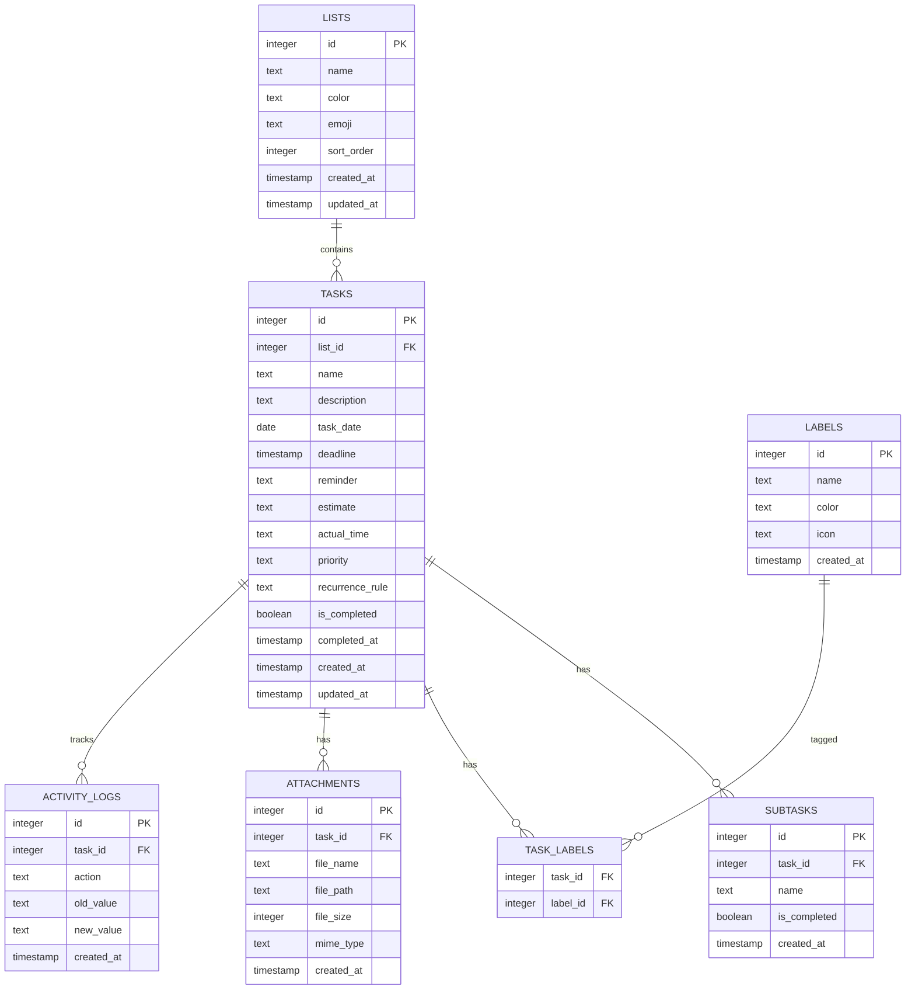
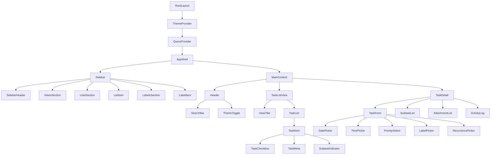
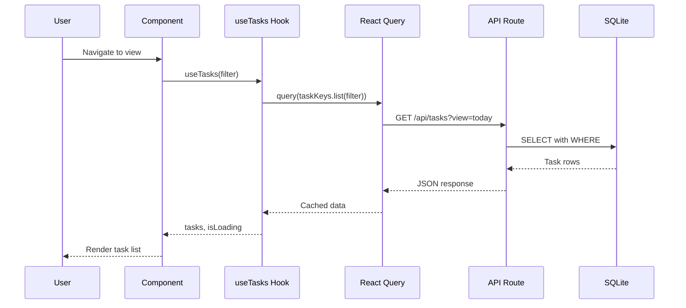
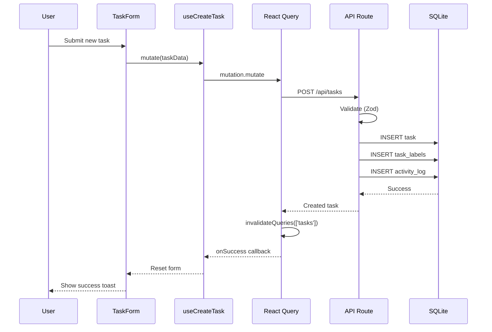

# Daily Task Planner - Technical Specification

## Overview

A production-ready daily task planner built with Next.js 16, featuring local-first SQLite storage, real-time search, and a polished split-view UI with dark/light theme support.

---

## 1. Project Structure

```
app/
├── layout.tsx                    # Root layout with theme provider
├── page.tsx                      # Main app entry (redirects to /today)
├── globals.css                   # Global styles + Tailwind
│
├── api/                          # RESTful API routes
│   ├── lists/
│   │   ├── route.ts              # GET (all), POST (create)
│   │   └── [id]/
│   │       ├── route.ts          # GET, PUT, DELETE
│   │       └── tasks/
│   │           └── route.ts      # GET tasks by list
│   ├── tasks/
│   │   ├── route.ts              # GET (all/filtered), POST (create)
│   │   ├── search/
│   │   │   └── route.ts          # GET fuzzy search
│   │   └── [id]/
│   │       ├── route.ts          # GET, PUT, DELETE
│   │       ├── complete/
│   │       │   └── route.ts      # POST toggle complete
│   │       ├── subtasks/
│   │       │   └── route.ts      # GET, POST
│   │       ├── attachments/
│   │       │   └── route.ts      # GET, POST
│   │       └── activity/
│   │           └── route.ts      # GET activity log
│   ├── labels/
│   │   ├── route.ts              # GET, POST
│   │   └── [id]/
│   │       └── route.ts          # GET, PUT, DELETE
│   └── views/
│       └── route.ts              # GET view data (today, upcoming, etc)
│
├── components/
│   ├── layout/
│   │   ├── AppShell.tsx          # Main split-view container
│   │   ├── Sidebar.tsx           # Collapsible sidebar
│   │   ├── MainContent.tsx       # Task list + detail view
│   │   └── Header.tsx            # Top navigation bar
│   │
│   ├── sidebar/
│   │   ├── SidebarHeader.tsx     # App title + new task button
│   │   ├── ViewsSection.tsx      # Today, Next 7, Upcoming, All
│   │   ├── ListsSection.tsx      # User lists + Inbox
│   │   ├── LabelsSection.tsx     # Filter by labels
│   │   ├── SidebarItem.tsx       # Reusable nav item
│   │   └── AddListButton.tsx     # Create new list
│   │
│   ├── task/
│   │   ├── TaskList.tsx          # Virtualized task list
│   │   ├── TaskItem.tsx          # Individual task row
│   │   ├── TaskDetail.tsx        # Task detail panel (split view)
│   │   ├── TaskForm.tsx          # Create/edit task form
│   │   ├── TaskCheckbox.tsx      # Animated completion toggle
│   │   ├── TaskMeta.tsx          # Due date, priority, estimate badges
│   │   ├── SubtaskList.tsx       # Nested subtasks
│   │   ├── AttachmentList.tsx    # File attachments
│   │   └── ActivityLog.tsx       # Task activity history
│   │
│   ├── ui/                       # shadcn/ui base components
│   │   ├── button.tsx
│   │   ├── input.tsx
│   │   ├── dialog.tsx
│   │   ├── dropdown-menu.tsx
│   │   ├── popover.tsx
│   │   ├── calendar.tsx
│   │   ├── select.tsx
│   │   ├── checkbox.tsx
│   │   ├── badge.tsx
│   │   ├── tooltip.tsx
│   │   ├── separator.tsx
│   │   ├── scroll-area.tsx
│   │   ├── skeleton.tsx
│   │   └── sonner.tsx
│   │
│   ├── forms/
│   │   ├── DatePicker.tsx        # Date selection with shortcuts
│   │   ├── TimePicker.tsx        # HH:mm input
│   │   ├── PrioritySelect.tsx    # Priority dropdown
│   │   ├── LabelPicker.tsx       # Multi-label selection
│   │   ├── RecurrencePicker.tsx  # Recurring task config
│   │   └── EmojiPicker.tsx       # List emoji selector
│   │
│   ├── search/
│   │   ├── SearchBar.tsx         # Global search input
│   │   ├── SearchResults.tsx     # Fuzzy search results
│   │   └── HighlightMatch.tsx    # Match highlighting
│   │
│   └── providers/
│       ├── ThemeProvider.tsx     # Dark/light mode
│       └── QueryProvider.tsx     # React Query provider
│
├── hooks/
│   ├── useTasks.ts               # Task CRUD operations
│   ├── useLists.ts               # List CRUD operations
│   ├── useLabels.ts              # Label CRUD operations
│   ├── useSearch.ts              # Fuzzy search hook
│   ├── useTaskFilter.ts          # View filtering logic
│   ├── useLocalStorage.ts        # Persist UI state
│   └── useDebounce.ts            # Input debouncing
│
├── lib/
│   ├── db/
│   │   ├── index.ts              # Database singleton + connection
│   │   ├── schema.ts             # Drizzle schema definitions
│   │   ├── migrations/           # SQL migration files
│   │   └── seed.ts               # Default data seeding
│   │
│   ├── utils/
│   │   ├── dates.ts              # Date manipulation helpers
│   │   ├── fuzzySearch.ts        # Fuse.js integration
│   │   ├── formatters.ts         # Time/duration formatting
│   │   ├── recurrence.ts         # Recurrence rule parsing
│   │   └── validations.ts        # Zod schemas
│   │
│   └── constants.ts              # App constants
│
├── types/
│   └── index.ts                  # Global TypeScript types
│
└── styles/
    └── theme.css                 # Custom theme variables
```

---

## 2. Database Schema

### Entity Relationship Diagram



### Tables

| Table | Purpose |
|-------|---------|
| `lists` | Task lists (Inbox + custom) |
| `tasks` | Main task entities |
| `labels` | Categorical labels with icons |
| `task_labels` | Many-to-many relationship |
| `subtasks` | Nested checkable items |
| `attachments` | File references |
| `activity_logs` | Audit trail |

### Indexes

- `tasks(list_id, is_completed, task_date)` - List filtering
- `tasks(task_date)` - Date-based views
- `tasks(is_completed, updated_at)` - Recently completed
- `task_labels(task_id)`, `task_labels(label_id)` - Join optimization
- `subtasks(task_id)` - Subtask retrieval
- `activity_logs(task_id, created_at)` - Activity timeline

---

## 3. TypeScript Types

### Core Entities

```typescript
// types/index.ts

export type Priority = 'high' | 'medium' | 'low' | 'none';

export type RecurrenceType = 
  | 'daily' 
  | 'weekly' 
  | 'weekday' 
  | 'monthly' 
  | 'yearly' 
  | 'custom';

export interface RecurrenceRule {
  type: RecurrenceType;
  interval?: number;
  daysOfWeek?: number[];      // 0-6 for weekly
  dayOfMonth?: number;        // 1-31 for monthly
  monthOfYear?: number;       // 1-12 for yearly
  endDate?: string;           // ISO date or null
  occurrences?: number;       // Max occurrences or null
}

export interface List {
  id: number;
  name: string;
  color: string;              // Hex color
  emoji: string;              // Single emoji
  sortOrder: number;
  createdAt: string;
  updatedAt: string;
}

export interface Label {
  id: number;
  name: string;
  color: string;              // Hex color
  icon: string;               // Lucide icon name
  createdAt: string;
}

export interface Task {
  id: number;
  listId: number;
  name: string;
  description: string | null;
  taskDate: string | null;    // YYYY-MM-DD
  deadline: string | null;    // ISO timestamp
  reminder: string | null;    // ISO timestamp or relative
  estimate: string | null;    // HH:mm format
  actualTime: string | null;  // HH:mm format
  priority: Priority;
  recurrenceRule: RecurrenceRule | null;
  isCompleted: boolean;
  completedAt: string | null;
  labels: Label[];
  subtasks: Subtask[];
  attachments: Attachment[];
  createdAt: string;
  updatedAt: string;
}

export interface Subtask {
  id: number;
  taskId: number;
  name: string;
  isCompleted: boolean;
  createdAt: string;
}

export interface Attachment {
  id: number;
  taskId: number;
  fileName: string;
  filePath: string;
  fileSize: number;
  mimeType: string;
  createdAt: string;
}

export interface ActivityLog {
  id: number;
  taskId: number;
  action: ActivityAction;
  oldValue: string | null;
  newValue: string | null;
  createdAt: string;
}

export type ActivityAction =
  | 'created'
  | 'updated'
  | 'completed'
  | 'uncompleted'
  | 'moved'
  | 'deleted'
  | 'attachment_added'
  | 'attachment_removed'
  | 'subtask_added'
  | 'subtask_completed'
  | 'reminder_triggered';
```

### View Types

```typescript
export type ViewType = 'today' | 'week' | 'upcoming' | 'all';

export interface ViewConfig {
  type: ViewType;
  title: string;
  icon: string;
  filter: TaskFilter;
}

export interface TaskFilter {
  dateRange?: { start: string; end: string };
  listId?: number;
  labelIds?: number[];
  priority?: Priority[];
  isCompleted?: boolean;
  searchQuery?: string;
}
```

### API Types

```typescript
// Request/Response types for API routes

export interface CreateTaskRequest {
  listId: number;
  name: string;
  description?: string;
  taskDate?: string;
  deadline?: string;
  reminder?: string;
  estimate?: string;
  priority?: Priority;
  labelIds?: number[];
  recurrenceRule?: RecurrenceRule;
}

export interface UpdateTaskRequest extends Partial<CreateTaskRequest> {
  isCompleted?: boolean;
  actualTime?: string;
}

export interface CreateListRequest {
  name: string;
  color: string;
  emoji: string;
}

export interface CreateLabelRequest {
  name: string;
  color: string;
  icon: string;
}

export interface SearchResult {
  tasks: Task[];
  totalCount: number;
  query: string;
}
```

---

## 4. API Route Design

### RESTful Endpoints

| Method | Route | Description | Query Params |
|--------|-------|-------------|--------------|
| GET | `/api/lists` | Get all lists | - |
| POST | `/api/lists` | Create new list | - |
| GET | `/api/lists/:id` | Get list by ID | - |
| PUT | `/api/lists/:id` | Update list | - |
| DELETE | `/api/lists/:id` | Delete list | - |
| GET | `/api/lists/:id/tasks` | Get tasks in list | `completed`, `sort` |
| GET | `/api/tasks` | Get filtered tasks | `view`, `listId`, `date`, `completed` |
| POST | `/api/tasks` | Create new task | - |
| GET | `/api/tasks/:id` | Get task detail | - |
| PUT | `/api/tasks/:id` | Update task | - |
| DELETE | `/api/tasks/:id` | Delete task | - |
| POST | `/api/tasks/:id/complete` | Toggle completion | - |
| GET | `/api/tasks/:id/subtasks` | Get subtasks | - |
| POST | `/api/tasks/:id/subtasks` | Add subtask | - |
| GET | `/api/tasks/:id/attachments` | Get attachments | - |
| POST | `/api/tasks/:id/attachments` | Upload attachment | - |
| GET | `/api/tasks/:id/activity` | Get activity log | `limit` |
| GET | `/api/search` | Fuzzy search | `q`, `limit` |
| GET | `/api/labels` | Get all labels | - |
| POST | `/api/labels` | Create label | - |
| PUT | `/api/labels/:id` | Update label | - |
| DELETE | `/api/labels/:id` | Delete label | - |

### Route Implementation Pattern

```typescript
// Example: app/api/tasks/route.ts
import { NextRequest, NextResponse } from 'next/server';
import { z } from 'zod';
import { db } from '@/lib/db';
import { tasks } from '@/lib/db/schema';

const createTaskSchema = z.object({
  listId: z.number(),
  name: z.string().min(1).max(500),
  description: z.string().optional(),
  taskDate: z.string().optional(),
  deadline: z.string().optional(),
  reminder: z.string().optional(),
  estimate: z.string().regex(/^\d{2}:\d{2}$/).optional(),
  priority: z.enum(['high', 'medium', 'low', 'none']).optional(),
  labelIds: z.array(z.number()).optional(),
});

export async function GET(request: NextRequest) {
  const { searchParams } = new URL(request.url);
  const view = searchParams.get('view') as ViewType | null;
  
  // Filter logic based on view type
  // ...
  
  return NextResponse.json({ tasks });
}

export async function POST(request: NextRequest) {
  const body = await request.json();
  const validated = createTaskSchema.parse(body);
  
  // Insert task + labels + log activity
  // ...
  
  return NextResponse.json({ task }, { status: 201 });
}
```

---

## 5. Component Hierarchy



---

## 6. State Management

### Architecture

- **Server State**: React Query (TanStack Query) for API data
- **Client State**: React Context for UI state (sidebar, theme, filters)
- **Local Storage**: Persist UI preferences (collapsed sections, last view)
- **URL State**: Shareable view filters via query params

### React Query Configuration

```typescript
// lib/queryClient.ts
import { QueryClient } from '@tanstack/react-query';

export const queryClient = new QueryClient({
  defaultOptions: {
    queries: {
      staleTime: 1000 * 60,      // 1 minute
      gcTime: 1000 * 60 * 5,     // 5 minutes
      retry: 2,
      refetchOnWindowFocus: false,
    },
  },
});
```

### Query Keys

```typescript
// hooks/useTasks.ts
export const taskKeys = {
  all: ['tasks'] as const,
  lists: () => [...taskKeys.all, 'list'] as const,
  list: (filters: TaskFilter) => [...taskKeys.lists(), filters] as const,
  detail: (id: number) => [...taskKeys.all, 'detail', id] as const,
};

// hooks/useLists.ts
export const listKeys = {
  all: ['lists'] as const,
  detail: (id: number) => [...listKeys.all, id] as const,
};
```

### Context Providers

```typescript
// contexts/ViewContext.tsx
interface ViewContextType {
  currentView: ViewType;
  setCurrentView: (view: ViewType) => void;
  showCompleted: boolean;
  setShowCompleted: (show: boolean) => void;
  selectedTaskId: number | null;
  setSelectedTaskId: (id: number | null) => void;
}

// contexts/SidebarContext.tsx
interface SidebarContextType {
  isCollapsed: boolean;
  setIsCollapsed: (collapsed: boolean) => void;
  expandedSections: string[];
  toggleSection: (section: string) => void;
}
```

---

## 7. Data Flow Architecture

### Read Flow



### Write Flow



### Optimistic Updates

- **Task Completion**: Update UI immediately, rollback on error
- **Subtask Toggle**: Immediate visual feedback
- **Reorder Lists**: Optimistic sort_order update

---

## 8. Search Architecture

### Fuzzy Search Strategy

- **Library**: Fuse.js for client-side fuzzy matching
- **Index**: Pre-computed task index stored in memory
- **Fields**: name, description, label names
- **Threshold**: 0.4 (balanced precision/recall)
- **Debounce**: 150ms on input

### Search Index

```typescript
// lib/search.ts
import Fuse from 'fuse.js';

interface SearchDocument {
  id: number;
  name: string;
  description: string;
  labels: string[];
  listName: string;
}

const fuseOptions = {
  keys: [
    { name: 'name', weight: 0.5 },
    { name: 'description', weight: 0.3 },
    { name: 'labels', weight: 0.15 },
    { name: 'listName', weight: 0.05 },
  ],
  threshold: 0.4,
  includeScore: true,
  includeMatches: true,
};

export function createSearchIndex(tasks: SearchDocument[]) {
  return new Fuse(tasks, fuseOptions);
}
```

---

## 9. Performance Considerations

### Database
- Connection pooling via `better-sqlite3`
- Prepared statements for frequent queries
- Indexes on all filter columns
- Lazy loading of task details

### UI
- Virtualized list for large task collections
- Code-splitting for TaskDetail panel
- Image optimization for attachments
- CSS containment for task items

### Caching
- React Query for server state
- Memoized selectors for filtered views
- LocalStorage for UI preferences

---

## 10. Error Handling

### API Errors
- Zod validation with detailed error messages
- 400 for validation errors
- 404 for missing resources
- 500 with generic message (log details server-side)

### UI Errors
- Error boundaries for component crashes
- Toast notifications for mutations
- Retry mechanisms for failed requests

---

## 11. Security Considerations

- Input sanitization via Zod schemas
- SQL injection prevention via parameterized queries
- File upload validation (size, type)
- Path traversal protection for attachments
